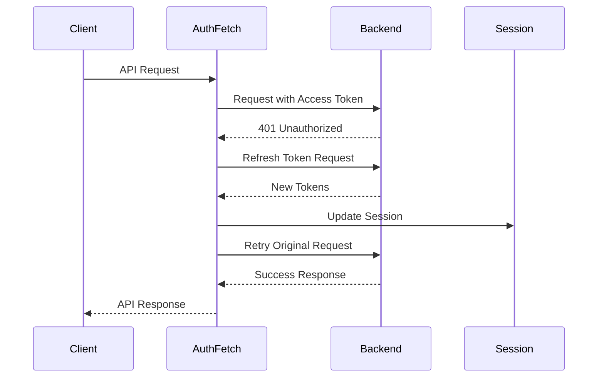

# JWT Token Refresh Implementation

This implementation provides a robust, professional JWT token refresh mechanism for your Next.js frontend application with automatic retry logic and race condition prevention.

## 🚀 Features

- **Automatic Token Refresh**: Transparently refreshes expired access tokens
- **Race Condition Prevention**: Ensures only one refresh request at a time
- **Error Handling**: Comprehensive error handling with proper cleanup
- **Security**: Secure token storage and validation
- **TypeScript**: Full TypeScript support with proper types
- **Professional Logging**: Structured logging for debugging

## 📁 Files Overview

### Core Files

1. **`lib/authFetch.ts`** - Main authenticated fetch function
2. **`lib/tokenRefresh.ts`** - Token refresh utilities
3. **`lib/sessions.ts`** - Session management (already exists)
4. **`hooks/use-auth.ts`** - React hooks for authentication
5. **`lib/apiExamples.ts`** - Usage examples

## 🔧 How It Works

### Token Refresh Flow

1. **Initial Request**: Make API call with access token
2. **401 Detection**: If request returns 401, token is likely expired
3. **Refresh Attempt**: Use refresh token to get new access token
4. **Retry Original**: Retry the original request with new token
5. **Cleanup on Failure**: If refresh fails, clear session and redirect to login

### Race Condition Prevention

Multiple simultaneous requests that encounter 401 errors will share the same refresh promise, preventing multiple refresh requests.

```typescript
// Global promise prevents race conditions
let refreshPromise: Promise<boolean> | null = null;
```

## 🛠️ Usage Examples

### Basic API Call

```typescript
import { authFetch } from '@/lib/authFetch';

const fetchUserData = async () => {
   try {
      const response = await authFetch('/user/profile');

      if (!response.ok) {
         throw new Error('Failed to fetch user data');
      }

      return await response.json();
   } catch (error) {
      console.error('Error:', error);
      throw error;
   }
};
```

### POST Request with Data

```typescript
const createParcel = async (parcelData: any) => {
   const response = await authFetch('/parcel', {
      method: 'POST',
      body: JSON.stringify(parcelData),
   });

   return await response.json();
};
```

### Using with React Hook

```typescript
import { useAuthenticatedApi } from '@/hooks/use-auth';

const MyComponent = () => {
  const { makeRequest, isLoading, error } = useAuthenticatedApi();

  const handleFetchData = async () => {
    const data = await makeRequest(() =>
      authFetch('/api/data').then(res => res.json())
    );

    if (data) {
      // Handle successful data
      console.log(data);
    }
  };

  return (
    <div>
      <button onClick={handleFetchData} disabled={isLoading}>
        {isLoading ? 'Loading...' : 'Fetch Data'}
      </button>
      {error && <p>Error: {error}</p>}
    </div>
  );
};
```

## 🔒 Security Features

### Token Storage

- Tokens are stored in secure HTTP-only cookies
- Session data is signed and encrypted using JWT
- Automatic cleanup on authentication failure

### Token Validation

- Refresh tokens are validated on the backend
- Invalid tokens trigger immediate session cleanup
- Proper error responses prevent information leakage

### Error Handling

```typescript
// Different error scenarios are handled appropriately
if (response.status === 401) {
   // Token expired - attempt refresh
} else if (response.status >= 500) {
   // Server error - don't refresh
} else {
   // Other errors - handle accordingly
}
```

## ⚙️ Configuration

### Environment Variables

Ensure these environment variables are set in your `.env.local`:

```env
API_URL=http://localhost:3001
SESSION_NAME=auth.quicko
SESSION_SECRET_KEY=your-session-secret-key
SESSION_SECRET_EXP=604800000
SESSION_SECRET_EXP_WITH_UNITS=7d
```

### Backend API Endpoints

Your backend should provide these endpoints:

- `POST /api/auth/refresh-token` - Refresh access token
- `DELETE /api/auth/signout` - Sign out user
- `GET /api/auth/session` - Get current session (optional)

## 🚨 Error Scenarios

### Handled Cases

1. **Access Token Expired**: Automatically refreshed using refresh token
2. **Refresh Token Expired**: User redirected to login page
3. **Network Errors**: Proper error messages and cleanup
4. **Server Errors**: Appropriate error handling without token refresh
5. **Race Conditions**: Multiple simultaneous requests handled correctly

### Error Response Format

```typescript
{
  success: boolean;
  error?: string;
}
```

## 🔄 Token Refresh Process



## 🧪 Testing

### Manual Testing

1. Make an API call with valid tokens
2. Wait for access token to expire
3. Make another API call
4. Verify token refresh happens automatically
5. Verify original request succeeds

### Error Testing

1. Remove refresh token from session
2. Make API call that returns 401
3. Verify redirect to login page

## 🎯 Best Practices

### Do's

- ✅ Always use `authFetch` for authenticated API calls
- ✅ Handle errors appropriately in your components
- ✅ Use the provided hooks for React components
- ✅ Test token refresh scenarios thoroughly

### Don'ts

- ❌ Don't bypass `authFetch` for authenticated requests
- ❌ Don't manually handle token refresh in components
- ❌ Don't store tokens in localStorage or sessionStorage
- ❌ Don't ignore error responses from `authFetch`

## 🔧 Customization

### Custom Headers

```typescript
const response = await authFetch('/api/endpoint', {
   headers: {
      'Custom-Header': 'value',
      // Authorization header is automatically added
   },
});
```

### Custom Error Handling

```typescript
const customAuthFetch = async (url: string, options?: FetchOptions) => {
   try {
      const response = await authFetch(url, options);
      return response;
   } catch (error) {
      // Custom error handling
      handleCustomError(error);
      throw error;
   }
};
```

## 📊 Monitoring

### Logging

The implementation includes structured logging for:

- Token refresh attempts
- Authentication failures
- Session cleanup operations
- Error scenarios

### Metrics to Monitor

- Token refresh success rate
- Authentication failure rate
- Session cleanup frequency
- API response times

## 🤝 Contributing

When making changes to the authentication system:

1. Ensure backward compatibility
2. Add appropriate tests
3. Update documentation
4. Consider security implications
5. Test edge cases thoroughly

## 📝 Changelog

### v1.0.0

- Initial implementation
- Automatic token refresh
- Race condition prevention
- Comprehensive error handling
- React hooks integration
- TypeScript support
